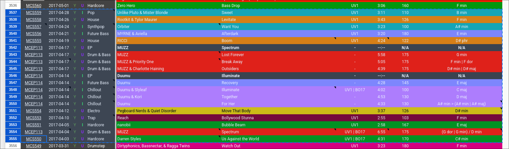

# rkf

rkf (RanK Format) is a Bash CLI tool to make it easier to make Monstercat/NCS rankings.

## Installation
Dependencies: wl-copy OR xclipboard depending on if you're on Wayland or X11. curl if you want to download it via the terminal.
### Linux
```bash
curl "https://github.com/ashasndr/rkf/releases/download/Release/rkf" > rkf
ln rkf ~/.local/bin/rkf
```
### Windows
Pretty much the same as Linux but via [WSL](https://learn.microsoft.com/en-us/windows/wsl/install)

## Usage: 
```
rkf [options]
```
Prerequisite: have copied valid data from the sheet, something like this:



### Examples:
```bash
rkf -me --et 1410 --sb "with a few extra songs that i forgot last month"
rkf -3 --ft "Ranking my own tracks"
```

### Options:
```
  -n            Use the NCS scheme
  -m            Use the Monstercat scheme
  -e            Use VNF emojis for genres
  -r            Use the last saved file and continue editing it
  -s            Disable separators (-=-= :emoji: =-=-)
  -2            2 lines (Artists, Songs)
  -3            3 lines (Genre, Artists, Songs)
                if neither 2 or 3 are selected, it'll default to full document lines.
  -d            display (cat) after execution
  -l            display (less) after exec
  -c            DO NOT copy result after finished
  -w            Sets you to Windows (WSL) mode (but likely already auto-detects if you are on windows, only use if you are experiencing issues)

  --title "yourtext"        Set a title (Ranking (scheme) (yourtext))
        aka --ti
  --subtitle "yourtext"     Set the subtitle
        aka --sb
  --fulltitle "yourtext"    Set a title (yourtext)
        aka --ft
        aka --full
  --expresstitle MMYY       Set a title (Ranking (scheme) (MM converted to month) 20(YY))
        aka --et
  -h, --help                Display help
  --last                    Shows last output
  --err                     Shows last error
  --cperr                   Copies last error
  --cplast                  Copies last output
  --mcatalog                Copies MCatalog URL
  --monstercatplaylist      Copies Monstercat playlist URL
  --ncsinfo                 Copies NCS Info URL
  --ncsplaylist             Copies NCS playlist URL
  --changelog               Display changelogs
```

## Features to come
- A "database" (a tsv) storing the entire sheets, which you can manually update, which would let you make rankings without needing to go CTRL C manually from MCatalog (or ncsinfo)
- Config file 

